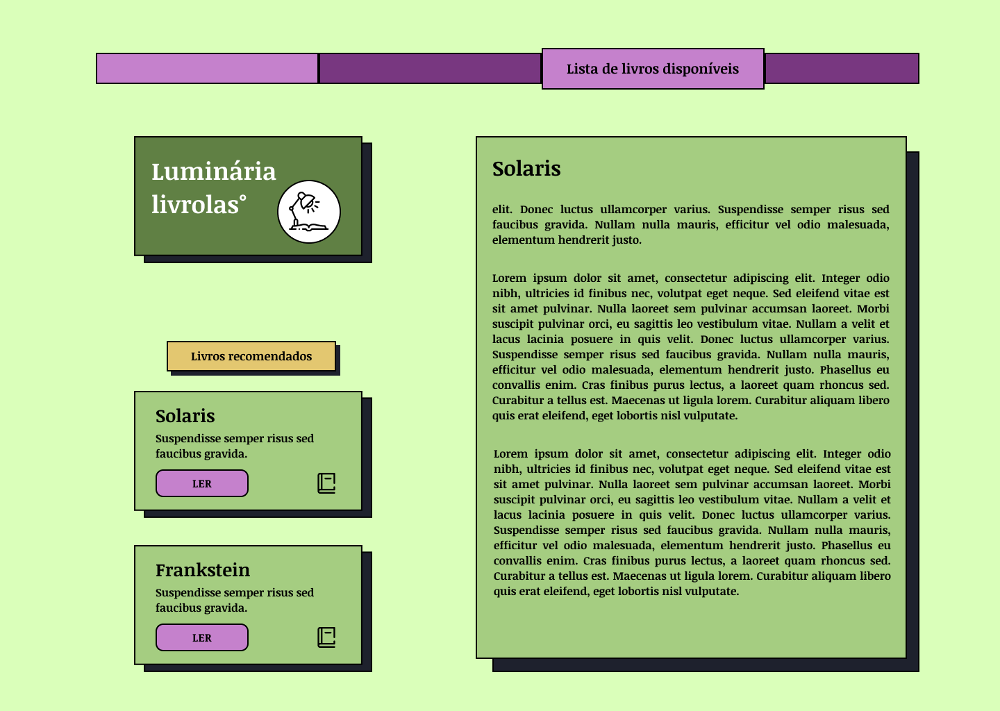
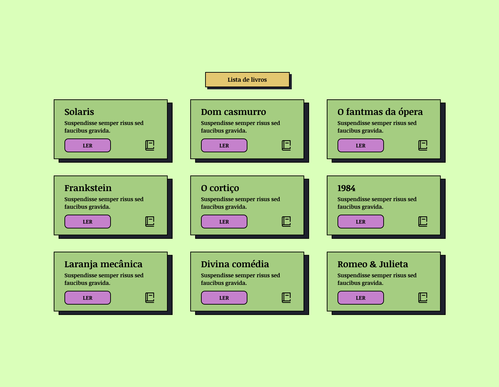

    

<!-- <h1 align="center"> Luminária livrolas°</h1> -->

Ambiente de leitura virtual, aconchegante e clean; facilitando e deixando a leitura do usuário menos maçante durante suas viagens literárias.

 

## Demonstração da aplicação

<h5>Pagina inicial - tema padrão</h5>

<h5>Pagina inicial - tema noturno</h5>

- Nestes ambientes demos o foco principal na leitura do usuário,   enfatizando o leitor de texto e também apresentando uma tipografia clara deixando sua leitura mais prazerosa.

<h5>Listagem dos livros - tema padrão e noturno</h5>

- Na lista de livros, decidimos apresentar de forma breve os titúlos e descrição de cada um deles.
   

Você pode acessar esta aplicação <a href="#" target="_blank">clicando aqui!</a>

## Roadmap

- Criar um ambiente de leitura aconchegante e agradável ao usuário.

- Design clean, dando ênfase nos conteúdos de textos principais.

## Funcionalidades

- Listar e recomendar livros ao usuário.
- Tema claro e noturno.
- Design responsivo.
- Leitor de texto.

## Tecnologias utilizadas

## 🖥️ Social medias

